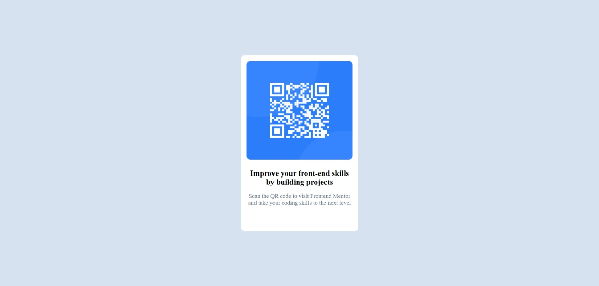

# QR Code Component

A simple and responsive QR code component built with **HTML and CSS**, based on a challenge from Frontend Mentor.

The goal of the project was to recreate the provided design as closely as possible while practicing fundamental HTML and CSS layout techniques.

## Screenshot



## Live Demo

<!-- Add your deployed project URL here -->

[View Live Site](YOUR_LIVE_SITE_URL)

## Built With

- HTML5
- CSS3
- CSS Flexbox
- Google Fonts
- Responsive viewport configuration

## Project Description

The challenge was to build a QR code component and make it look as close as possible to the provided Frontend Mentor design.

The component contains:

- A QR code image
- A heading encouraging users to improve their front-end skills
- A short description
- A centered card layout with rounded corners
- A light background matching the original design

The project focuses primarily on CSS layout, spacing, sizing, typography, colors, and positioning.

## Layout and Styling

The main component is centered on the page by using CSS Flexbox on the `<body>` element.

```css
body {
  display: flex;
  justify-content: center;
  align-items: center;
}
```

This centers the card both horizontally and vertically within the viewport.

The main `.container` acts as the card that contains the QR code, heading, and paragraph. It is styled with:

- A fixed width and height
- Padding
- A white background
- Rounded corners
- Spacing between its elements

The QR code image uses a percentage-based width and height, making its dimensions relative to the container.

The text elements are centered and styled with different font sizes, weights, margins, and colors to match the design.

## Project Structure

```text
QR-code-component/
│
├── images/
│   ├── favicon-32x32.png
│   ├── image-qr-code.png
│   └── screenshot.png
│
├── index.html
├── style.css
└── README.md
```

## What I Practiced

Through this project, I practiced:

- Structuring a webpage using HTML
- Linking an external CSS file
- Using CSS Flexbox for page layout
- Horizontally and vertically centering elements
- Working with `width` and `height`
- Using relative dimensions such as percentages
- Applying padding and margins
- Creating rounded corners with `border-radius`
- Styling typography
- Working with HSL colors
- Using custom fonts
- Creating a layout based on a reference design

## How to Run the Project

1. Clone or download the repository.
2. Open the project folder in your code editor.
3. Open `index.html` in your browser.

Alternatively, if you are using VS Code with Live Server, right-click `index.html` and select **Open with Live Server**.

## Challenge

This project was completed as part of a Frontend Mentor challenge.

The original challenge description:

> Your challenge is to build out this QR code component and get it looking as close to the design as possible.

## Author

**Klejdi Bozha**

---

This project was created for practicing fundamental HTML and CSS skills and improving front-end layout and styling techniques.
